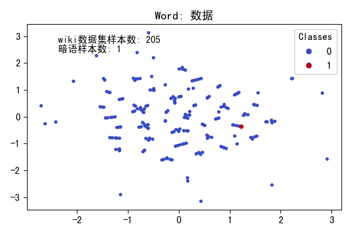
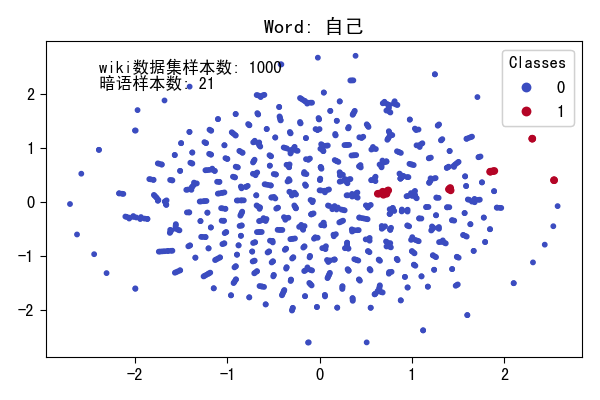

# 基于MECT4CNER修改的版本

原仓库：[MECT4CNER_Repo](https://github.com/CoderMusou/MECT4CNER)

## dev log

- 2023.8.23 开始尝试对英文词汇添加词根拆分功能。运行中英混搭数据集命令：

```bash
python debug1.py --dataset demo
```

- 2023.9.3 调试复盘

思考了一下，发现之前处理英文单词的思路不太对。

之前的思路是在CNN偏旁embedding中对英文单词去找词根，达到和偏旁部首类似的效果

但是在整个模型中lattice embedding部分模型也会把英文单词拆开，所以上面单独找词根其实是无用功

而且单独找词根还会出现句子长度在lattice embedding和radical embedding中不一致的情况，一边是把单词直接拆成字母，另一边是把单词当做一个汉字

所以正确的做法应该是将单词拆成字母直接放进去

所以应该一开始在处理数据集的时候就把单词拆开

哎搞了这么久原来是这个的原因，有点气的

不过这个自己做的数据集总是会报错说``Invalid instance which ends at line:xxx has been dropped``

找了找，应该是数据集的问题，数据集中有爬取的时候没处理好的nbsp符号，把数据集处理一下就好了

- 2023.9.3 中英混搭数据集适配修改总结

现在看来上面的思路没有问题，就是直接将英文一个字母一个字母的拆开放到数据集中去，其他的其实不用修改，硬要说的话也就改AdaptSelfAttention.py里面那个句子长度（原仓库issue里面提到过的）

不过现在遇到的问题是，英文加入后，句子长度会急剧增加，句子中的可能词组数量（span数量）也会急剧增加，这样就使得模型的AdaptSelfAttention.py里面的那一部分的维度数增多了，这样的话24G显存就不太够用。

一个解决方法是使用多卡训练，大一点的GPU训练等等。多卡训练还没研究明白，大的GPU没有。

另一个解决办法是将数据集中长度太长的句子直接删掉，现在就是这样做的，训练集已经跑起来了。现在是凌晨，等今天早上起床看看效果如何。

# 11.5 日工作工作总结

## MECT4CNER 模型结构展示

重新梳理了model.py文件中的MECT4CNER模型结构，具体结构如下：


## 完善了CSR_MECTNER模型

基于MECT4CNER模型的结构，新写了一个CSR_MECTNER模型，将这个模型的Output改成了输出中间结果：

```py
if self.training:
    loss = self.crf(pred, target, mask).mean(dim=0)
    return {'loss': loss}
else:
    pred, path = self.crf.viterbi_decode(pred, mask)
    result = {
        'pred': pred,
        'fusion': fusion,
        'radical_encoded': radical_encoded,
        'char_encoded': char_encoded,
        'seq_output': seq_output,
        'batch_size': batch_size,
        'max_seq_len_and_lex_num': max_seq_len_and_lex_num,
        'max_seq_len': max_seq_len

    }

    return result
```

接下来应该就能进行下一步词向量的合成了

# 11.6 日工作总结

- 完成了CSR_MECTNER模型的结构调整，将输出定向到了seq_output变量中，研究了seq_output变量的形状
- 确定了接下来的思路：

首先使用任意方法A进行词向量合成，然后使用dbscan进行聚类，观察不同的数据集对于同一个词语效果是否有区别，以此来判断算法效果

然后结合效果，对方法A和聚类算法进行修改优化

# 11.7 日工作总结

- 构建了字向量到词向量的模块``CharacterToWord.py``，后续可以将提升后的模型接入该类中
- 构建贴吧数据集

这里需要注意的一点是，贴吧数据集不需要做标记，也就是所有的字的标记都是O。这样的话直接用这个数据集套上已有的模型，就可以直接输出词向量，可以认为这个词向量是基于已有的MECT4CNER模型的拟合的模型构建的。

但是仅仅替换数据集好像不太行，因为fastnlp的Trainer训练的时候存的是模型的statedict，因此加载模型的时候需要把原模型初始化出来后再load
state dict，否则的话模型size不匹配，应该得想个别的办法弄弄

尝试用微博训练出来的模型去跑贴吧的数据集，然后发现报这个错：

```py
TypeError: forward()
missing
4
required
positional
arguments: 'bigrams', 'seq_len', 'lex_num', and 'target'
```

一开始以为是表的问题，试了试原数据集，发现又能跑动，然后就估计是原数据表和新数据表的内容不一样

但是翻来覆去看，就没看到啥问题，两个表的表头和数据类型都是一模一样的

然后以为是词表太大了，把词表搞小一点，贴吧数据集只拿了11句话来弄，但是小词表也是不行

很无语

到处找了一下午，最后突然灵光乍现想起了这个：

> fastnlp.core.Trainer的forward的参数来自于datasets变量中被设为input的field

然后调试了一下贴吧数据集的表的信息：


| field_names | chars | target | bigrams | seq_len | lexicons | raw_chars | lex_num | lex_s | lex_e | lattice | pos_s | pos_e |
| ----------- | ----- | ------ | ------- | ------- | -------- | --------- | ------- | ----- | ----- | ------- | ----- | ----- |
| is_input    | False | False  | False   | False   | False    | False     | False   | False | False | True    | True  | True  |
| is_target   | False | False  | False   | False   | False    | False     | False   | False | False | False   | False | False |
| ignore_type |       |        |         |         |          |           |         |       |       | False   | False | False |
| pad_value   |       |        |         |         |          |           |         |       |       | 0       | 0     | 0     |

然后发现，上面报错的那四个变量，确实没有放到input里面去。。。。。。一下午时间就干了个这个。。。。。。。

同时，如果外接数据集过大的话，确实会出现词表溢出的情况，比如下面：

```py
Traceback(most
recent
call
last):
File
"/root/autodl-tmp/Chinese-Slang-Recognition-with-MECT-Model/debug1.py", line
701, in < module >
test_label_list = predictor.predict(sentence)  # 预测结果
File
"/root/miniconda3/envs/normalpython/lib/python3.9/site-packages/fastNLP/core/predictor.py", line
64, in predict
prediction = predict_func(**refined_batch_x)
File
"/root/autodl-tmp/Chinese-Slang-Recognition-with-MECT-Model/model.py", line
267, in forward
bigrams_embed = self.bigram_embed(bigrams)
File
"/root/miniconda3/envs/normalpython/lib/python3.9/site-packages/torch/nn/modules/module.py", line
727, in _call_impl
result = self.forward(*input, **kwargs)
File
"/root/autodl-tmp/Chinese-Slang-Recognition-with-MECT-Model/Modules/StaticEmbedding.py", line
309, in forward
words = self.words_to_words[words]
IndexError: index
94392 is out
of
bounds
for dimension 0 with size 42889
```

现在测得，对于贴吧数据集，使用微博的MECT模型，句子数量在5k是可以满足词表大小的，此时词表大小只有12396左右，微博MECT模型词表大小有42889

- 构建聚类模块cluster.py

初步跑了一下聚类，发现在tieba数据集中和weibo数据集中，很多词语的向量在前两维上都有共性，比如下图为“你”这一字符在前两维的投影


# 11.8 日工作总结

对项目进行一些修补，同时训练了新的模型：

- 给服务器安装了字体，让聚类的结果能够以完整的中文图片展示
- 修改了字向量转化为词向量的处理逻辑，将词汇表中所有可行的词语都进行转换

这个工作的思路是，对于已有的句子，不能转化的就跳过，能转化的就转换。最后算出来的结果，发现只有7%的句子可以被转换，落实到数据上是达到了214443句，比之前的句子稍微多一些

- 训练了msra的mect模型

训练出这个模型的目的是看能不能扩大词表从而提升一下贴吧数据集中识别出来的词语的数量

为了达到这个目的，我还特地重新更新了一下数据集，保证除了onenote的数据集以外的其他数据集都是完整的

# 11.9 日工作总结

今日主要工作是需要构建聚类模块

- 构建聚类模块和评测指标

对于一个词语在多个数据集中的聚类结果，我们考虑如下问题

1：如何判断聚类结果的相似性

2：如果不相似，如何寻找其差异之处

其实第二个问题相对好解决，只要A数据集和B数据集的有差异，那么就说明A和B中的该词语的词义不同，然后就直接找聚类结果就行了

对于第一个问题，现在先提出两种方法：

第一：最简单的方法，就是判断最大可聚类数X的差值，X的值可以是直接取hardmax或者取softmax也可以

第二：对某个范围内的聚类值进行取样，这样对于一个词语在一个数据集中就会有一个聚类值序列。对于一个词语在两个数据集中的聚类值序列A和B，计算A和B的相似度即可。

对于第二种途径，先可以尝试采用[DWT时序匹配](https://liudongdong.blog.csdn.net/article/details/80344976)算法进行计算

[DWT时序匹配朴素代码在这里](https://zhuanlan.zhihu.com/p/87437065)

函数现在是构建好了，但是运行速度太慢了，一下午只能比较一丢丢东西，结果大概是这种情况：

```
100%|█████████████████████████████████████████████████████████████████████████████████████████████████| 10/10 [00:00<00:00, 25.60it/s]
100%|█████████████████████████████████████████████████████████████████████████████████████████████████| 10/10 [04:34<00:00, 27.42s/it]
word 我 in dataset weibo and tieba with function 取样函数: difference is 252.0
word 我 in dataset weibo and tieba with function 最大化聚类函数: difference is 422
100%|█████████████████████████████████████████████████████████████████████████████████████████████████| 10/10 [00:00<00:00, 35.19it/s]
100%|████████████████████████████████████████████████████████████████████████████████████████████████| 10/10 [17:07<00:00, 102.79s/it]
word 了 in dataset weibo and tieba with function 取样函数: difference is 241.0
word 了 in dataset weibo and tieba with function 最大化聚类函数: difference is 291
100%|█████████████████████████████████████████████████████████████████████████████████████████████████| 10/10 [00:00<00:00, 35.58it/s]
100%|█████████████████████████████████████████████████████████████████████████████████████████████████| 10/10 [03:47<00:00, 22.77s/it]
word 你 in dataset weibo and tieba with function 取样函数: difference is 258.0
word 你 in dataset weibo and tieba with function 最大化聚类函数: difference is 414
```

- 新建了基于PKU语料库的外来数据集

PKU语料库汇总起来确实大，能够达到1个多G的pkl，和tieba语料库相当了

测试结果也表示，PKU语料库中和tieba的重合字词集合中终于出现了词语，之前weibo和tieba的集合中都只有单个字的

- 使用msra的mect模型进行了数据集构建

实验证明，msra的模型词表就是大，同样是对于贴吧数据集，msra模型的词表能达到47%的成功率，微博模型的词表只有7%

# 11.10 日工作总结

- 提出第三种评测指标

第一种指标的缺点很明显，就不说了。

第二种指标也有缺点。首先，一个词语即使是暗语，在同一个数据集中它也可能会有正常的用法。因此反应在聚类上，暗语词汇的特征则是，同一个词语在不同的数据集上的聚类数量有微小且持久的差距（这里说的微小且持久，意思是，由于暗语词汇存在一些语义明显不同的上下文语义，因此暗语数据集的聚类结果总是比平常数据集的结果多一些，无论聚类的eps取多少）。但是如果使用第二种指标，那么这种微小且持久的差距是完全反应不出来的。因为第二种指标是使用的聚类数量为基准，对于每一个eps，第二种指标下，词语在数据集A和数据集B中的聚类差距应该是恒定的，因此第二种指标会认为这不是差距，从而忽略暗语特征。

因此现在需要结合上述问题提出第三种评测指标

- 提出对整套算法的评测方案

首先找数据集，数据集中人为的挑出一些暗语，然后以这些暗语为样本进行测试，计算F1值。

- 开发记忆化模块，使用缓存进行提速

详见Utils/AutoCache.py

关于提速这件事情，之前做过的调研表示，其实sklearn也是可以gpu加速的，使用cudf包就可以，但是问题在于，这个包一般的pip安装不了，得下源代码编译。

于是找了另外一个库：[sklearnex库](https://cloud.tencent.com/developer/article/2042042)

这个库据说也可以加速一些，但是是基于CPU加速的，服务器的GPU还是闲着的......

- 添加数据集

添加了暗语数据集，使用msra的模型能够达到100%的转化率，可以的

下一步是需要去找一些有明显俚语的数据集

# 11.11 日工作总结

- 构建了暗语数据集，查看了一下暗语数据集中出现次数大于1000的词语的大致情况如下

```text
，, 。, 的, 数据, 附件, ., 商品, 描述, .., 有, 交易, 发货, 不, 条, 是, 自动, 1, 拍, 编号, 了, 我, 你, 可以, 美金, 后, 万条, 
信息, 2, 在, 都, 请, 万, 姓名, 可, 和, 邮箱, 5, 退款, 3, ,, 购买, 需要, 电话, 网站, 就, 身份证, 年, 美国, 地址, 等, 复制, 
女性, 也, 价格, 下载, 截图, 出售, 为, 链接, 视频, 4, 最新, 月, 用户, 下, 虚拟, 看, 号, 自己, 资源, 格式, 拍下, 接受, 全国, 
出, 10, 个, 内, 一手, 测试, 性, 留言, 教程, 会, 时间, 到, 再, 客户, 一个, 包含, 一, 给, 含, 注册, 四, 要素, 份, 联系, 8, 
手机号, 资料, 部分, 使用, 被, 能, 平台, 直接, 放款, 6, 100, 下单, 付款, 具有, 提供, 一经, 微信, 人, 大, 做, 印度, 图片, 如果, 
问题, 一份, 手机, 网盘, 多, 没有, 用, 7, 来, 软件, 不要, 棋牌, 其他, 内容, 去, 详细, 站, 本人, 支持, 账号, 已经, 这个, 打包, 
```

# 11.13 日工作总结

构建了统计词语在数据集中出现过的句子的功能

同时选取了一些词语进行聚类

# 11.15日工作总结

跑完了选取的词语，结果存在clusterLog.txt中

# 11.17日工作总结

构建了暗语词语识别模块

接下来是考虑怎么评测模型效果

# 11.27日工作总结

总结一下这几天做的事情和现在的思路

首先，构建了[MNGG数据集](https://github.com/Andrew82106/MNGG_Dataset)

这个数据集是基于dogwhistle数据集和THUCNEWS数据集，通过替换的方式形成的数据集合。

通过这个数据集，我们就有了打标的数据。

通过这个打标好的数据我们就可以测试模型识别暗语的效果，然后也可以进行暗语的解释

然后通过这样的实验证明我们提出的这套框架是有效的，只需要进行数据集的替换就可以使用CSR_MECT达到识别不同领域的暗语的效果。

此时就可以得到CSR_MECT的一个优势

## CSR_MECT的优势之一

CSR_MECT的巨大优势之一，是不需要打标好的数据，只需要纯文本就行。

具体而言，对于暗语识别这个任务，除开CSR_MECT以外还有两种思路，第一种是将暗语识别当做一个二分类任务，使用SVM这类算法进行识别。第二种是将暗语识别当做一个序列标注任务，用BERT这类算法进行标注。

但上述的两种方法都是只有在有标注的数据预训练下才能使用的方法，但CSR_MECT只需要用预训练好的MECT模型，然后往模型里面输入纯文本就可以进行识别，不需要对暗语数据进行打标

## 接下来的工作

第一，需要修改CSR_MECT模型。因为模型当前的工作模式还是和暗语识别的工作模式不太匹配，效率也不高，因此需要修改。

具体而言，第一，CSR_MECT模型当前只能识别出一整个语料库中的可能是暗语的词语，并不能识别出哪个句子中有暗语。第二，CSR_MECT模型的聚类算法效率太低，计算开销太大。

第二，需要基于MNGG数据集进行测试。

具体而言，需要基于MNGG数据集测试各种序列标注模型的效果，包括LR-CNN、LGN、lattice-lstm、BERT-NER和修改后的CSR_MECT模型

然后看实验效果进行下一步工作。

## 有个idea

仔细看11月7日的图，不难发现，对于同一个word来说，在相同的eps下，如果两个数据集中这个词语使用的方式类似，那么其聚类效果在空间上的分布也是一样的

比如图里面的句号，在两个数据集中聚类结果形状一样，位置也一样

那么，是不是我们可以通过直接对比当前词语的向量和已知当前词语在正常数据集中的聚类结果就可以判断词语是否是暗语词汇了？

比如：

```python
def checkWord(word, clusterResult):
    for cluster in clusterResult:
        if word in cluster:
            return True
        else:
            return False
```

# 11.28 日工作总结

首先对聚类结果进行了测试：

选取了“吧、在、我们、是、的”这几个词语在anwang,msra,PKU,tieba,weibo,wiki中的聚类结果


可以直观的看出来，吧、是、的这三个字在所有数据集中的分布形状都类似（weibo数据集太小了因此会有一些偏差）

同时也可以从吧、是、的三个字的聚类结果看出来，聚类结果的位置是相同的，不存在需要缩放的情况

但是这可能和词语长度有关系，因为可以看出，除了“我们”一词以外，其他的词语都是单字。在算法中有一个流程是将字向量转化为词向量。因此需要再做一些实验看看常用词语的聚类结果

于是我们再次选取了“我们、他们、历史、工作、自己、中国”几个词语聚类，结果如下：


不难得出如下结论：

首先，聚类位置关系和词语长度没有直接关系，比如“自己”一词，都是在原点左右。

第二，词语和其用法是具有集聚效应的，比如“工作”一词，不同数据集中的聚类结果都具有类似的形状。再比如“自己”一词，不同数据集中都有一个蓝绿色三角形的形状（数据太少的weibo数据集除外），这个形状大概率代表着该词语的某一种上下文用法。

因此，接着11.27的思路说，对于一个词语word的向量，我们需要判断这个词语的向量是否在标准词库向量的聚类结果中，如果在，那么就不是新的用法，否则就是新的用法。

现在看来，要实现这一点，要做两件事：

1.需要一个标准的词库

2.需要一个判断词语的向量是否在标准词库向量的聚类结果中的函数

标准的词库就用wiki就行，上面的图中也发现了wiki绝对是数据量最丰富的

对于这个函数，可以通过计算聚类结果核心点和向量的距离来实现。

伪代码大概是这样

```python
def is_in_epsilon_neighborhood(new_vector, core_points, epsilon, metric='euclidean'):
    # 计算新向量与核心点之间的距离
    distances = pairwise_distances(core_points, [new_vector], metric=metric)

    # 判断新向量是否在 ε-邻域内
    is_in_epsilon = np.any(distances <= epsilon)

    return is_in_epsilon
```

# 12.1日工作总结

找到了dbscan的document：[DBSCAN](https://scikit-learn.org/stable/modules/clustering.html#dbscan)

找到一个可视化dbscan的：[可视化dbscan](https://www.naftaliharris.com/blog/visualizing-dbscan-clustering/)

然后对dbscan的相关模块进行了调试：

首先我们担心模块不能正确聚类，或者不能找到核心点

于是我们在debug.py中设计了模块进行实验

具体来讲，我们设置了如下的点：

```python
clusterA = [
        [0, 0],
        [1, 0],
        [1, 1],
        [0, 1],
        [1, 2]
    ]
clusterB = [
        [10, 10],
        [11, 10],
        [11, 11],
        [10, 11]
    ]
clusterC = [
        [-10, -10],
        [-11, -10],
        [-11, -11],
        [-10, -11]
    ]
```

然后设定``eps=1.42, min_samples=4``，对核心点和非核心点进行画图，实验结果如下：


同时代码中输出核心点坐标如下：

```text
tensor([[  0,   0],
        [  1,   0],
        [  1,   1],
        [  0,   1],
        [ 10,  10],
        [ 11,  10],
        [ 11,  11],
        [ 10,  11],
        [-10, -10],
        [-11, -10],
        [-11, -11],
        [-10, -11]]) 12
```

也就是说[1,2]这个点没被识别成核心点，说明代码能够成功聚类并且返回核心点坐标

然后第二个实验是具体的拿一个词语出来进行聚类，统计聚类结果的核心点和离群点数量，然后用距离公式算具体的离群点数量，看两个对得上不

一开始结果是对不上的，后面排查后发现是因为在聚类的时候对坐标做了一个标准化，但是在计算距离的时候没有标准化，这就导致了问题

改了后结果如下：

```text
聚类结果离群点数：161
基于距离公式计算的离群点数：161
聚类结果聚类数量：2
```

看了下标准化库的注释：

```text
Standardize features by removing the mean and scaling to unit variance.

    The standard score of a sample `x` is calculated as:

        z = (x - u) / s

    where `u` is the mean of the training samples or zero if `with_mean=False`,
    and `s` is the standard deviation of the training samples or one if
    `with_std=False`.
```

感觉问题不大

第三个实验是用轮廓系数对聚类结果进行测试，然后看看有没有办法尽量调参调到最好的那个轮廓系数

代码层面是用silhouette_score()计算所有点的平均轮廓系数

聚类结果的轮廓系数的取值在[-1,1]之间，值越大，说明同类样本相距约近，不同样本相距越远，则聚类效果越好

现在的想法是先多做几次实验，看看不同的数据集中不同的词语在不同的参数取值下的轮廓系数表现如何

具体实验结果如下：


看来在min_samples=4的情况下，eps为18是一个非常合适的值

那现在就以这个值为标准先写一下算法

要说到改算法的话有一个问题那就比较麻烦了，就是main.py太臃肿了改不太动

我准备新建一个模块来写将字词转化为向量的接口

# 12.2日工作总结

完成了字向量转词向量的接口的初步构建

# 12.4日工作总结

完成了聚类评测算法的构建，最后跑出来的结果非常shi：

```text
Evaluate data in 0.05 seconds!
[tester] 
SpanFPreRecMetric: f=0.056696, pre=0.036524, rec=0.126638
label_acc: acc=0.882294
```

其实看到模型输出来的数据就知道这个f值肯定特别shi

一堆404一堆False，词典小加上误判率高，F1值低是必然的

# 12.7日工作总结

首先要做的一件事情是检查聚类算法的整个流程逻辑是不是合理。这样做的原因是担心不合理的流程会导致错误的结果。

检查了一下，函数的流程大体是没问题的。

从calcSentence中我们定义基dataset（也就是wiki），同时定义一些参数。

然后在这个函数中，第一行

``cutResult = preprocess()``

中我们取出待测数据集的向量化结果

然后我们取出向量化结果cutResult中的每一个词语，用这个词语在基dataset（也就是wiki）中的历史记录中去聚类，然后将聚类结果返回的核心点用于计算该词语是否在范围内

最后我们得出总结果

这个思路没问题，那么现在我们需要写脚本测试一下之前的404词语中有多少是不在wiki的词汇表里面的，顺便统计一下各个base数据集的词表大小。

统计了一下各个数据集的词汇表大小：

```
wiki_vector:42970
anwang_vector:47828
PKU_vector:72698
msra_vector:14541
weibo_vector:3203
tieba_vector:14935
```

还统计了一下404词语在各个数据集词汇库中遗漏的情况：

```
在所有的5096个404词语中，有3145是不在wiki词表中的，占比61.71507064364207%
在所有的5096个404词语中，有2527是不在anwang词表中的，占比49.58791208791209%
在所有的5096个404词语中，有1205是不在PKU词表中的，占比23.645996860282576%
在所有的5096个404词语中，有3082是不在msra词表中的，占比60.478806907378335%
在所有的5096个404词语中，有3550是不在weibo词表中的，占比69.6624803767661%
在所有的5096个404词语中，有2524是不在tieba词表中的，占比49.529042386185246%
```

还统计了一下所有的词汇在各个词汇库中的占比情况

```
在所有的10485个词语中，有3145是不在wiki词表中的，占比29.995231282784932%
在所有的10485个词语中，有2591是不在anwang词表中的，占比24.711492608488317%
在所有的10485个词语中，有1210是不在PKU词表中的，占比11.540295660467335%
在所有的10485个词语中，有3253是不在msra词表中的，占比31.025274201239867%
在所有的10485个词语中，有4373是不在weibo词表中的，占比41.70720076299475%
在所有的10485个词语中，有2805是不在tieba词表中的，占比26.75250357653791%
```

这样看来，用PKU作为基础词表其实更好

那么现在要做的，就是使用PKU做基础词表，同时记录下聚类结果为404的词语的原因，然后根据聚类结果进行下一步操作。

在PC上跑了一会儿，一共发现两处可能导致404的地方：

第一种是这样的：

```text
INFO: clustering word:抛锚
success running cluster function
聚类结果离群点数：4
聚类结果聚类数量：1
INFO: clustering word 抛锚 with error Found array with 0 sample(s) (shape=(0, 320)) while a minimum of 1 is required by check_pairwise_arrays.
```

第二种则是这样的：

```text
INFO: clustering word:鬼恐
eps:18
X:None
dataset:PKU
word:鬼恐
INFO: clustering word 鬼恐 with error Expected 2D array, got scalar array instead:
array=nan.
Reshape your data either using array.reshape(-1, 1) if your data has a single feature or array.reshape(1, -1) if it contains a single sample.
```

这下就好办些了，先debug一下然后看看结果

第二种情况的原因很简单，就是聚类结果为1的时候不会返回核心点坐标的。这个时候我们就直接把所有的点都当做核心点就可以了。

那么现在我们把更新后的代码拿回去再跑一遍看看识别率之类的有没有提高

毕竟现在统计出来的404词汇占比：

```text
print(f'404词汇占总词汇的{100*len(ListOf404)/len(AllWordList)}%')
> 404词汇占总词汇的48.60276585598474%
```

# 12.8日工作总结

昨天的代码结果跑出来了：

```text
SpanFPreRecMetric: f=0.050655, pre=0.126638, rec=0.031659
label_acc: acc=0.860457
```

反而降低了一些

现在统计一下404词汇的占比和其他的情况：

```text
404词汇占总词汇的29.995231282784932%

在所有的3145个404词语中，有3145是不在wiki词表中的，占比100.0%
在所有的3145个404词语中，有2072是不在anwang词表中的，占比65.88235294117646%
在所有的3145个404词语中，有1077是不在PKU词表中的，占比34.24483306836248%
在所有的3145个404词语中，有2251是不在msra词表中的，占比71.57392686804451%
在所有的3145个404词语中，有2200是不在weibo词表中的，占比69.9523052464229%
在所有的3145个404词语中，有1792是不在tieba词表中的，占比56.97933227344992%
```

那么现在说明剩下的404词汇都是词表的问题了

那么现在就需要扩展词汇表

# 12.9日工作总结

看到一个这个：

```text
Embedding-V1是基于百度文心大模型技术的文本表示模型，将文本转化为用数值表示的向量形式，用于文本检索、信息推荐、知识挖掘等场景。
版本数量:
```

后面可以考虑用这个玩一下

# 12.10日工作总结

数据增强跑出来了，但是始终有10个词语造不出来句子

这10个词语必然是暗语词汇。。。。

# 12.12日工作总结

数据增强后的新wiki数据集跑出来了

现在的结果和之前的结果对比如下：


| 数据集      | 数据集的词汇表大小 | 所以词语占比                        |
|----------|-----------|-------------------------------|
| old wiki | 42970     | 所有10485个词语，3145是不在wiki中的，占29% |
| new wiki | 47262     | 所有10485个词语，184是不在wiki中的，占1%   |

接下来就是处理新数据

# 12.15日总结

现在的问题是，处理新数据的开销太大了，跑一次70个小时起步，因此急切的需要优化算法

经过测试，cluster算法本身有问题，太慢。还有就是read_vector这个函数开销太大了。

先改改read_vector这个函数看看

# 12.17日总结

现在的问题是，向量聚类的效果和shi一样。。。。。

```text
SpanFPreRecMetric: f=0.035406, pre=0.179039, rec=0.019645
label_acc: acc=0.695467
```

我在想，是不是因为是向量的问题？

我先用百度的向量接口跑一跑？多给点钱也无所谓。这样的话至少可以知道是不是聚类算法的问题，也方便调试聚类算法。

但是尝试了一下，发现百度的接口也不能直接用，因为它是把输入的文字直接输出成一个向量，也就是说一个词语只有一个向量的。

那就换个思路，走论文里面说的向量语义值的评测。

词向量的评估方法这篇文章写得很清楚：

[word vector evaluation](https://zhuanlan.zhihu.com/p/156828242)

现在需要研究一下这个问题，也就是需要保证词向量是有道理的才行。

发现了评测机制的一个小问题，就是把404搞成非暗语了。404应该搞成暗语。这样的话值会高一些，但也没高多少

```text
SpanFPreRecMetric: f=0.0408, pre=0.222707, rec=0.022457
label_acc: acc=0.679607
```

# 12月19日总结

现在使用``char_encoded``作为输出的词向量进行处理，和之前使用``fusion``作为输出词向量进行处理，发现效果反而变差了

现在研究陷入僵局

那现在就先做这些事情：

1. 看一看现在增强后的404数据有多少，比率是否下降，从而判断数据增强是否有效
2. 对聚类结果进行可视化，把暗语词汇和非暗语词汇的结果进行对比，然后把暗语词汇的向量放入图中，观察规律，从而判断当前算法是否有效

# 12月20号总结

404词语统计结果：``404词语共184个，在10485个词语中占比1.7548879351454458%``

说明404词语是变少了的，之前都是29%的比例，几千的404词语。这说明数据增强是达到了目的的。

聚类结果分析

**这么多天来的唯一一个好消息**

为了降维我们先比较了几种降维方法：


发现UMAP和t-SNE效果比较好

然后降维后的效果：

<div style="display: flex; flex-direction: row;">
    
    
    
    
    
    
</div>


这些词语在部分的句子中都是暗语词汇

<div style="display: flex; flex-direction: row;">
    
    
    
    
</div>


这些词语不是暗语词汇

那么现在直接将数据降维成两维，那么出来的效果p值肯定高，但r值肯定低

还发现一个问题，就是很多暗语词汇其实没有被分词分出来，因此需要修改分词算法

还有一个问题，就是数据集中暗语词汇的上下文文本很乱，啥都有，因此需要清洗一下MNGG数据集

现在实验稍微有点希望了。

明天的任务是：

- 修改分词方法，升级wiki.pkl
- 加入降维，将聚类算法修改为距离计算算法即可
- 看效果

# 12.21号总结

- 修改分词方法，升级wiki.pkl:

升级前：

```text
1685
1685
668暗语词汇在wiki.pkl中
977正常词汇在wiki.pkl中
```

升级后：

```text
1685
1685
743暗语词汇在wiki.pkl中
984正常词汇在wiki.pkl中
```

**那这就有个问题了。。。这1685个暗语词汇，用到实际中的有多少个？743个暗语词汇占这些用到实际中的暗语词汇的百分之多少？**

先下一步吧，后面再说这个。

- 加入降维，将聚类算法修改为距离计算算法即可

先不降维，先用原来的跑：

```text
404词语共3233个，在16204个词语中占比19.951863737348802%
[testing result]
comparing file /Users/andrewlee/Desktop/Projects/Chinese-Slang-Recognition-with-MECT-Model/datasets/NER/test/input.bio with /Users/andrewlee/Desktop/Projects/Chinese-Slang-Recognition-with-MECT-Model/clusterRes/Result.bio
Evaluate data in 0.07 seconds!                                                                                                       
[tester] 
SpanFPreRecMetric: f=0.279161, pre=0.572581, rec=0.184575
label_acc: acc=0.731987

```

404词语太多了看来，现在需要重新增强一下数据

用下面这段脚本测试了一下：

```python
def test3():
    List_404 = []
    with open("./wiki.pkl", "rb") as f:
        cont = pickle.load(f)
    with open("./test.pkl", "rb") as f:
        cont_test = pickle.load(f)
    for word in cont_test['fastIndexWord']:
        if word not in cont['fastIndexWord']:
            List_404.append(word)

    print(len(List_404))
```

结果：

```text
1918
```

然后再增强试试(由于网速原因，没有增强完全)

结果：

```text
408
```

说明有大幅改进

